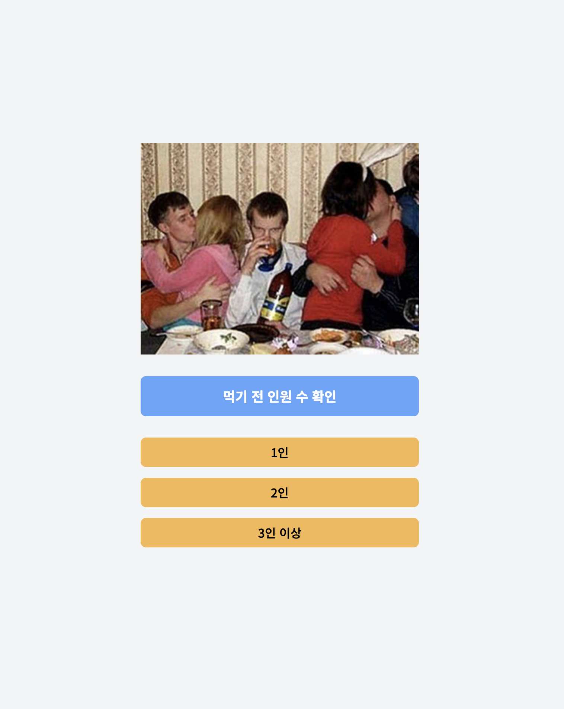
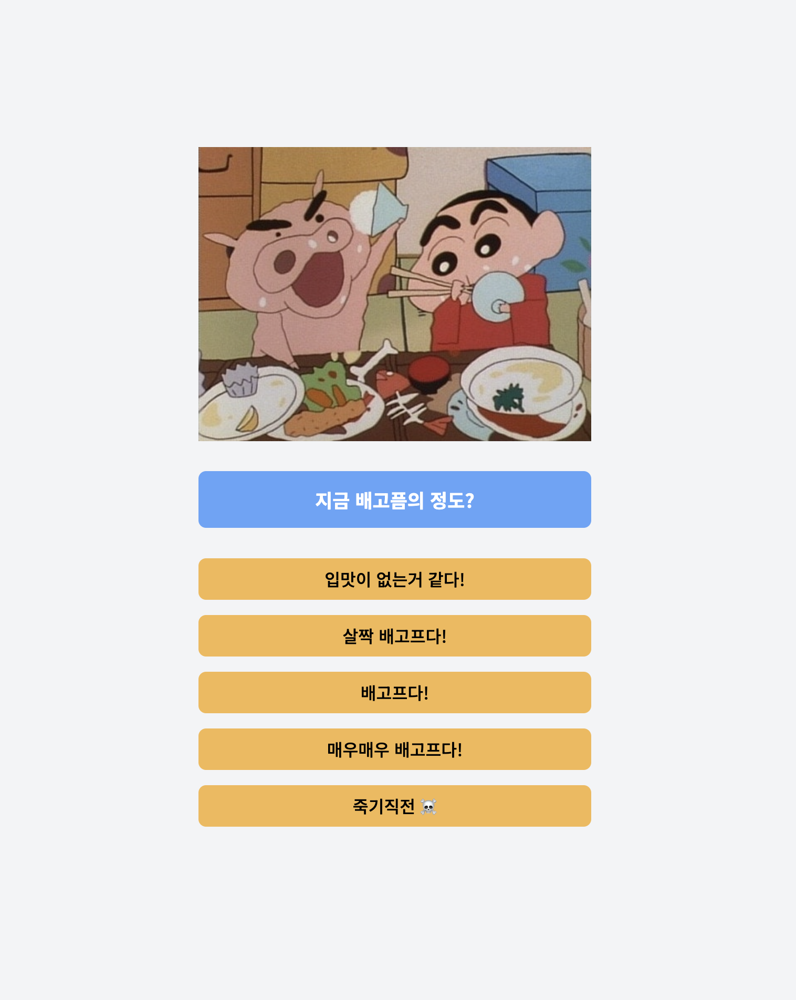
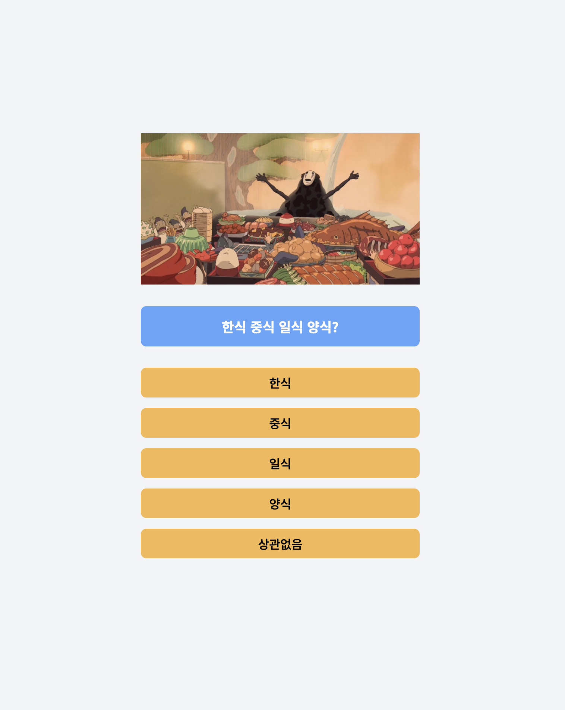
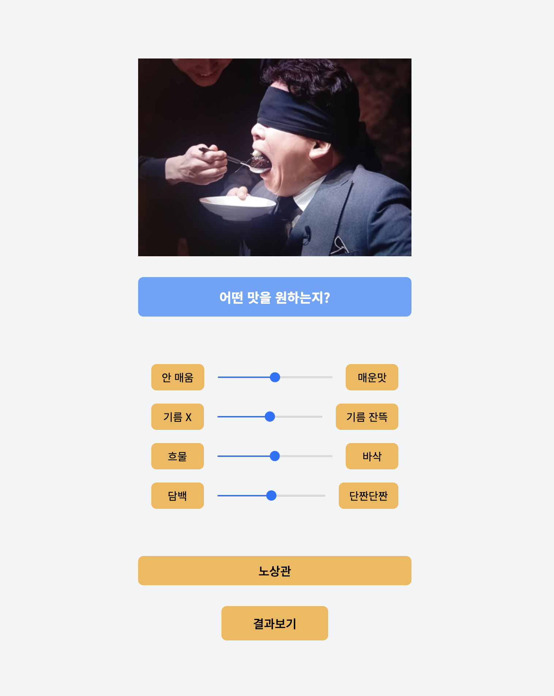
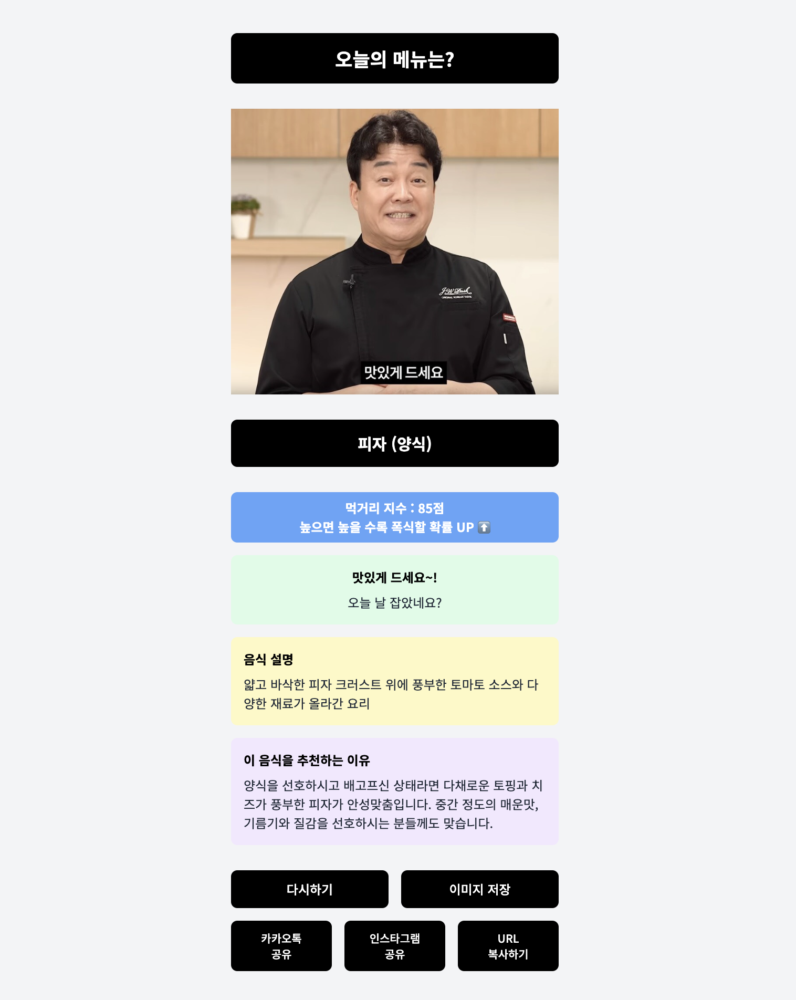

## 오늘 뭐 먹지 🍽️

간단한 설문조사를 통해 AI가 설문조사 결과를 분석하여  
결과를 내려주는 웹 어플리케이션입니다!

### 🌐 웹사이트
[EatMaker](https://eatmaker-b680dc4fddc6.herokuapp.com/)

### 📊 기능
- **사용자 친화적인 설문조사**: 직관적인 UI로 쉽게 설문에 참여할 수 있습니다.
- **AI 기반 결과 분석**: 설문 결과를 AI가 분석하여 개인 맞춤형 음식 추천을 제공합니다.
- **다양한 음식 추천**: 사용자의 선호도에 따라 다양한 음식 옵션을 제안합니다.
- **장고 기반 개발**: 안정적이고 확장 가능한 웹 어플리케이션을 위해 Django 프레임워크를 사용했습니다.

## 📸 스크린샷
| 스크린샷 | 설명 |
|  | 메인 화면 |
|  | 설문조사 페이지 |
|  | 설문조사 페이지 |
|  | 설문조사 페이지 |
|  | 설문조사 페이지 |
|  | 결과 화면 |

## 🎥 시연 영상
| 영상 | 설명 |
|  | 전체 기능 시연 |

### 📞 연락처
이메일: joon271694@gmail.com